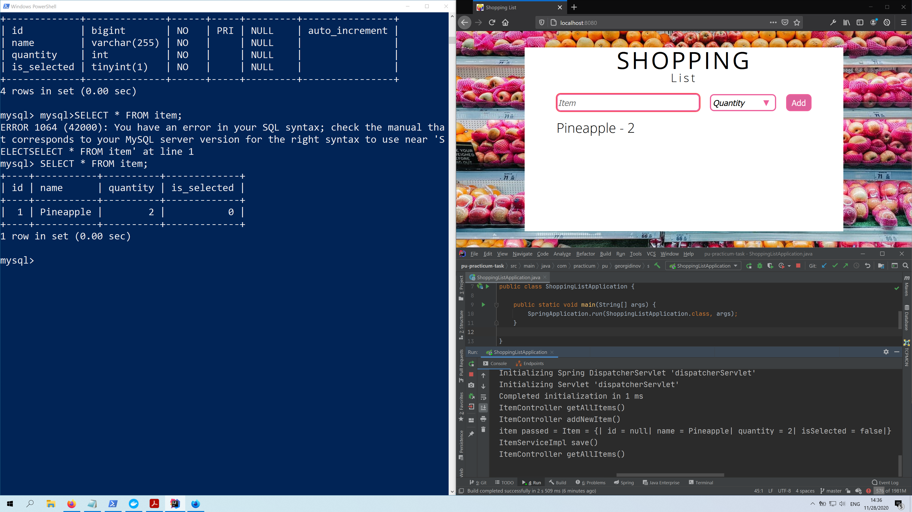
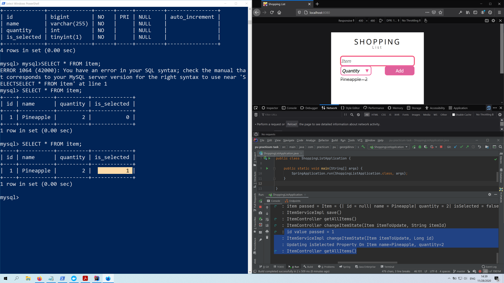
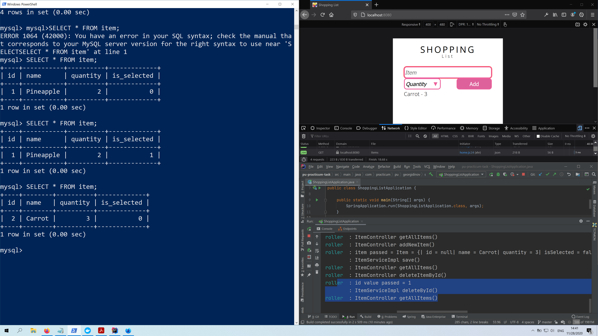

Very Basic Full Stack Single Page Application Representing The Idea Of Shopping List

For persistence on my local environment I use Docker container and MySQL DBMS

You can run it without persistence with H2 in memory database by comment and uncomment
a few lines in application properties file.  
The table for H2 database will be created from data-h2.sql file on start up.  
If you want to place mock data you can do insertions there. 

In case you have docker on your machine, and you want to persist the data   
I've prepared brief explanation on how to run configured docker image for our database(see bellow the screenshots).

Main Functionality Overview

Add New Item
 

Cross Item When Clicked For The First Time
 

Mobile View
 

Delete Crossed Item When Clicked
 

MySQL On Docker   
    The following command will download and configure mysql image if used for the first time, 
if you already have this image on your machine it will not download it, unless different tag name is specified or newer tag version is released. 
    It will configure root password to 'mysql', it will create database 'shopping_items_db',  
it will create new user 'practicum' with user_password 'practicum', 
and it will assign this user as superuser for the database(shopping_items_db). 
 -v stands for volume and if you want your database to be persisted after container its stopped you should use it in your command.  
For our case with mysql after the path on your machine you need to add :/var/lib/mysql 
 it is mysql specific for other containers read documentation what is needed.  
 -d the container will run as a background process  

The command 

    docker run --name mysql-container -e MYSQL_ROOT_PASSWORD=mysql -e MYSQL_DATABASE=shopping_items_db -e MYSQL_USER=practicum -e MYSQL_PASSWORD=practicum -v D:\Programming\DOCKER_DATA\MySql\shopping_items_db:/var/lib/mysql -p 3306:3306 -d mysql

In case you want to start / stop your container

    docker stop mysql-container
    docker start mysql-container

Open Bash In Your Container

    docker exec -it mysql-container bash

Sigh In With Your User And Password From The docker run command

    mysql --user=practicum -p
    
   Now Just Type Or Paste The Following Queries 
 
    SHOW DATABASES;

    USE shopping_items_db;

    CREATE TABLE item (
    id BIGINT AUTO_INCREMENT NOT NULL PRIMARY KEY,
    name varchar(255) NOT NULL,
    quantity INT NOT NULL,
    is_selected BOOLEAN NOT NULL
    );

Start Yor Spring Boot Application 
Or After Maven Clean Install Run It As Fully Executable Jar File