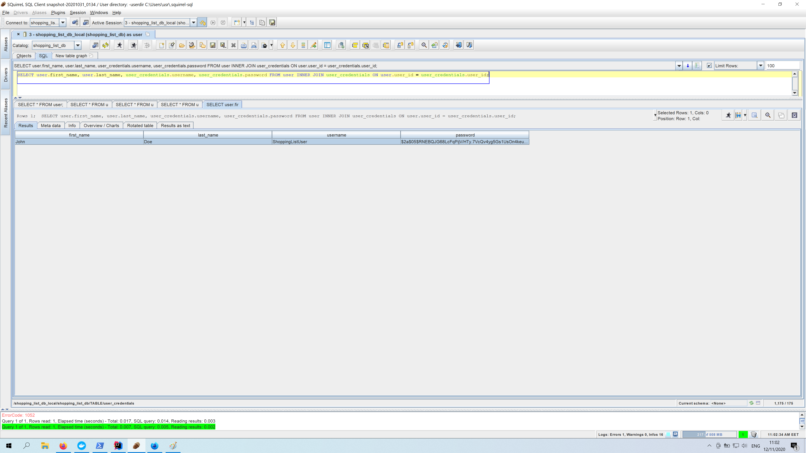
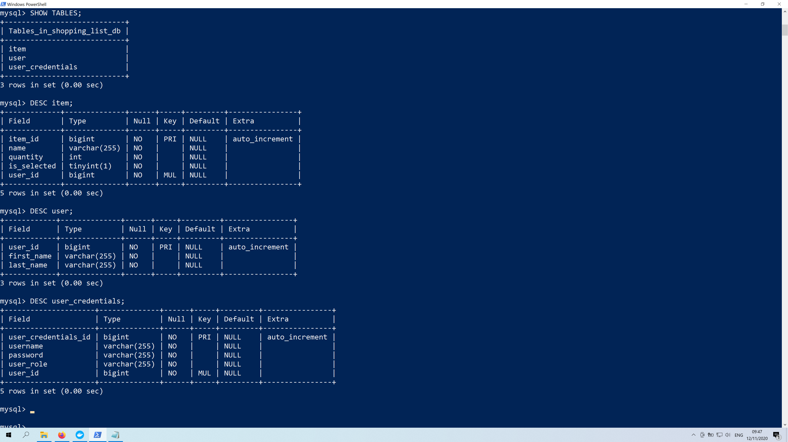
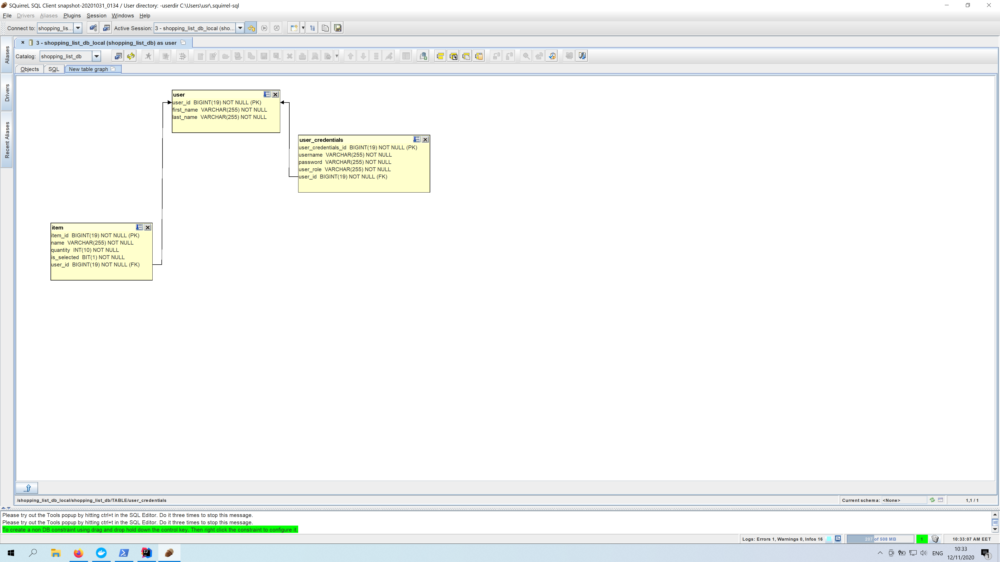

Very Basic And Simple Application Representing The Idea Of Shopping List  

After the initial test project(branch shopping-list-poc) I've decided to explore further the idea and add login capabilities 
I am planning to add functionality for custom lists of items e.g. Grocery Store List, Market List, Fast Food List etc.  
Before that I am planning major refactoring on both front end and back end parts. 

For persistence on my local environment I use Docker container and MySQL DBMS

You can run it with H2 in memory database by default, if you wish to use MySQL DBMS  
Uncomment active profile setting in application.properties file and comment out H2 configurations  

    spring.profiles.active=local

In case you have docker, or MySQL server installed on your machine, and you want to persist the data   
I've prepared brief explanation on how to run configured docker image and build our database(see bellow the screenshots)
.

Main Functionality Overview

Login Page
 

Registration Form
 

Filled Registration Form
 

Redirection to Login Page After Successful Registration
 

Database Query Upon Registration
 

Home page After Login
 

Adding New Item
 

Marking Item For Deletion (First Click On Item Draw A Line Trough)
 

Deleting Previously Lined Trough Item
 

Database Overview
 

Database Graph Overview
 

MySQL On Docker   
The following command will download and configure mysql image if used for the first time, 
if you already have this image on your machine it will not download it, unless different tag name is specified or newer
tag version is released. 
It will configure root password to 'mysql', it will create database 'shopping_list_db',  
it will create new user 'user' with user_password 'password', 
and it will assign this user as superuser for the database(shopping_list_db). 
-v stands for volume and if you want your database to be persisted after container its stopped you should use it in your
command.  
For our case with mysql after the path on your machine you need to add  

    :/var/lib/mysql

it is mysql specific for other containers read documentation what is needed.  
-d the container will run as a background process  

The command 

    docker run --name shopping-list-db -e MYSQL_ROOT_PASSWORD=mysql -e MYSQL_DATABASE=shopping_list_db -e MYSQL_USER=user -e MYSQL_PASSWORD=password -v D:\Programming\DOCKER_DATA\MySql\shopping_list_db:/var/lib/mysql -p 3306:3306 -d mysql

In case you want to start / stop your container

    docker stop shopping-list-db
    docker start shopping-list-db

Open Bash In Your Container

    docker exec -it shopping-list-db bash

Sigh In With Your User And Password From The docker run command

    mysql --user=user -p

Now Just Type Or Paste The Following Queries 

    SHOW DATABASES;

    USE shopping-list-db;

    CREATE TABLE user (
	user_id BIGINT AUTO_INCREMENT NOT NULL PRIMARY KEY,
	first_name varchar(255) NOT NULL,
	last_name varchar(255) NOT NULL
    );

    CREATE TABLE user_credentials (
    user_credentials_id BIGINT AUTO_INCREMENT NOT NULL PRIMARY KEY,
    username varchar(255) NOT NULL,
    password varchar(255) NOT NULL,
    user_role varchar(255) NOT NULL,
    user_id BIGINT NOT NULL,
    FOREIGN KEY(user_id) REFERENCES user (user_id)
    );
    
    CREATE TABLE item (
    item_id BIGINT AUTO_INCREMENT NOT NULL PRIMARY KEY,
    name varchar(255) NOT NULL,
    quantity INT NOT NULL,
    is_selected BOOLEAN NOT NULL,
    user_id BIGINT NOT NULL,
    FOREIGN KEY(user_id) REFERENCES user (user_id)
    );

Start Yor Spring Boot Application 
Or After Maven Clean Install Run It As Fully Executable Jar File